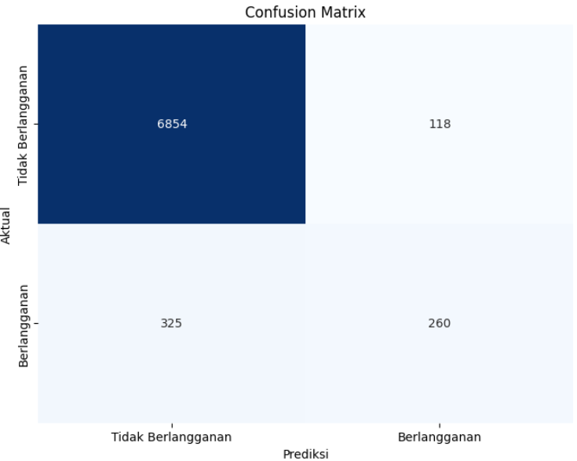

# bank-deposit-prediction

---

## **Deskripsi Projek**
Projek ini bertujuan untuk memprediksi apakah klien akan berlangganan deposito berjangka berdasarkan kampanye pemasaran langsung yang dilakukan oleh sebuah bank di Portugal. Dataset yang digunakan adalah [Bank Marketing Dataset](https://www.kaggle.com/datasets/henriqueyamahata/bank-marketing) dari Kaggle.

Projek ini mencakup seluruh alur kerja Data Science, mulai dari **Exploratory Data Analysis (EDA)**, **Data Preprocessing**, dan **Pemodelan Machine Learning**. Model terbaik yang dihasilkan adalah **Random Forest** dengan akurasi **94.14%** dan F1-Score **54.00%**.

---

## **Dataset**
Dataset ini berisi informasi tentang klien bank dan kampanye pemasaran yang dilakukan. Berikut adalah kolom-kolom yang ada dalam dataset:

### **Informasi Klien**
- `age`: Usia klien (numerik).
- `job`: Pekerjaan klien (kategorikal: admin, technician, services, dll.).
- `marital`: Status pernikahan (kategorikal: married, single, divorced).
- `education`: Tingkat pendidikan (kategorikal: primary, secondary, tertiary, dll.).
- `default`: Apakah klien memiliki kredit macet? (kategorikal: yes, no).
- `housing`: Apakah klien memiliki pinjaman perumahan? (kategorikal: yes, no).
- `loan`: Apakah klien memiliki pinjaman pribadi? (kategorikal: yes, no).

### **Informasi Kontak Terakhir**
- `contact`: Jenis komunikasi terakhir (kategorikal: cellular, telephone).
- `day`: Hari terakhir dihubungi (numerik: 1-31).
- `month`: Bulan terakhir dihubungi (kategorikal: jan, feb, mar, dll.).
- `duration`: Durasi panggilan terakhir dalam detik (numerik).

### **Informasi Kampanye**
- `campaign`: Jumlah kontak yang dilakukan selama kampanye ini untuk klien tersebut (numerik).
- `pdays`: Jumlah hari sejak klien terakhir dihubungi dari kampanye sebelumnya (numerik, -1 jika tidak dihubungi sebelumnya).
- `previous`: Jumlah kontak sebelum kampanye ini (numerik).
- `poutcome`: Hasil kampanye pemasaran sebelumnya (kategorikal: success, failure, dll.).

### **Variabel Target**
- `y`: Apakah klien berlangganan deposito berjangka? (kategorikal: yes, no).

---

## **Langkah-Langkah Projek**

### **1. Exploratory Data Analysis (EDA)**
- Analisis statistik deskriptif untuk memahami dataset.
- Visualisasi distribusi fitur numerik dan kategorikal.

### **2. Data Preprocessing**
- **Handling Missing Values**: Tidak ada missing values dalam dataset ini.
- **Handling Outliers**: Handling Outliers pada kolom 'Age' dan 'Duration'
- **Encoding Fitur Kategorikal**: Menggunakan Label Encoding untuk target (`y`) dan fitur input.
- **Feature Scaling**: Standarisasi fitur numerik menggunakan `StandardScaler`.

### **3. Pemodelan Machine Learning**
- Membangun dan mengevaluasi beberapa model:
  - **Logistic Regression**
  - **Random Forest**
  - **Support Vector Machine (SVM)**
- Model terbaik dipilih berdasarkan metrik evaluasi (akurasi, presisi, recall, F1-Score, AUC-ROC).

---

## **Hasil**

### **Evaluasi Model Terbaik (Random Forest)**
- **Akurasi**: 94.14%
- **Presisi**: 68.78%
- **Recall**: 44.44%
- **F1-Score**: 54.00%
- **AUC-ROC**: 71.38%

### **Confusion Matrix**

- Akurasi model tinggi (94.14%), tetapi recall rendah (44.44%). Ini menunjukkan bahwa model cenderung memprediksi lebih banyak False Negative (klien yang sebenarnya berlangganan tetapi diprediksi tidak berlangganan).
- Disebabkan ketidak seimbangan dataset. Jumlah klien yang tidak berlangganan (kelas negatif) jauh lebih banyak daripada yang berlangganan (kelas positif). Ini menyebabkan model lebih baik dalam memprediksi kelas negatif.
- F1-Score yang moderat menunjukkan keseimbangan antara presisi dan recall.
